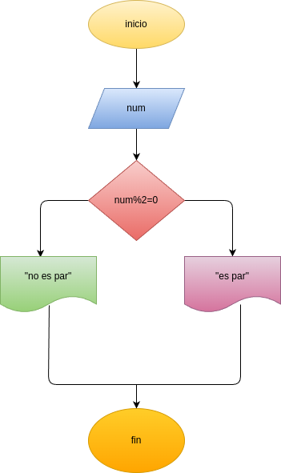

# Par_Impar
programa para determinar si es un numero par o inpar

# Analisis

## Input

### Variables de entrada
num: digite unnumero
### processing

num % 2 == 0

### output
Par o impar
# Diseño

# Construcion 
